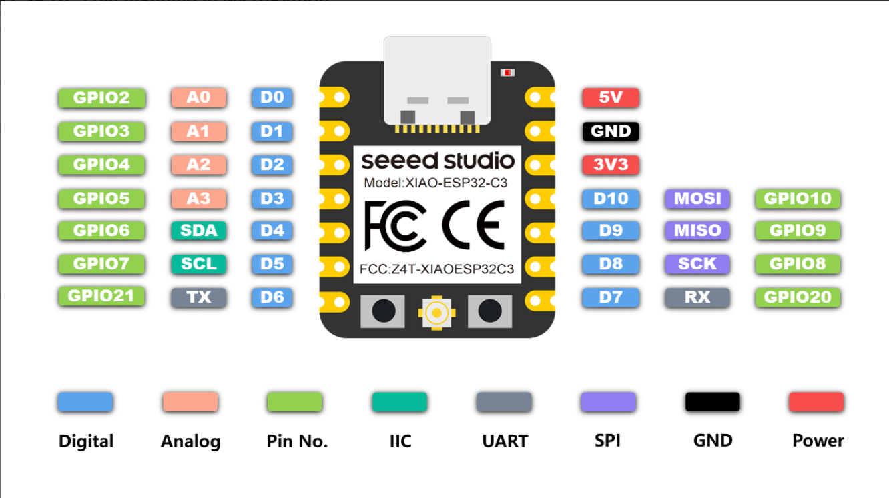

<div align="center">

  <h1>GPS MGRS Toolkit — ESP32-C3</h1>

  <p>
    XIAO ESP32-C3 GPS platform with a from-scratch WGS84 &rarr; UTM &rarr; MGRS conversion library.
  </p>

<!-- Badges -->
<p>
  <a href="https://github.com/ColdBore-RD/GPS_MGRS_Toolkit_ESP32C3/graphs/contributors">
    
  </a>
  <a href="https://github.com/ColdBore-RD/GPS_MGRS_Toolkit_ESP32C3/commits/main">
    
  </a>
  <a href="https://github.com/ColdBore-RD/GPS_MGRS_Toolkit_ESP32C3/network/members">
    
  </a>
  <a href="https://github.com/ColdBore-RD/GPS_MGRS_Toolkit_ESP32C3/stargazers">
    
  </a>
  <a href="https://github.com/ColdBore-RD/GPS_MGRS_Toolkit_ESP32C3/issues/">
    
  </a>
  <a href="https://github.com/ColdBore-RD/GPS_MGRS_Toolkit_ESP32C3/blob/main/LICENSE">
    
  </a>
</p>

<h4>
    <a href="MGRS/README.md">Library Docs</a>
  <span> · </span>
    <a href="https://github.com/ColdBore-RD/GPS_MGRS_Toolkit_ESP32C3/issues/">Report Bug</a>
  <span> · </span>
    <a href="https://github.com/ColdBore-RD/GPS_MGRS_Toolkit_ESP32C3/issues/">Request Feature</a>
  </h4>
</div>

<br />

<!-- Table of Contents -->
# Table of Contents

- [About the Project](#about-the-project)
  * [Repository Structure](#repository-structure)
  * [Hardware](#hardware)
  * [Tech Stack](#tech-stack)
  * [Features](#features)
  * [Validated MGRS Output](#validated-mgrs-output)
- [Getting Started](#getting-started)
  * [Prerequisites](#prerequisites)
  * [Installation](#installation)
  * [Wiring](#wiring)
  * [Compiling and Flashing](#compiling-and-flashing)
- [Usage](#usage)
- [Roadmap](#roadmap)
- [Contributing](#contributing)
- [FAQ](#faq)
- [License](#license)
- [Contact](#contact)
- [Acknowledgements](#acknowledgements)

<!-- About the Project -->
## About the Project

This repository is a Seeed XIAO ESP32-C3 GPS development platform. It pairs a hardware UART GPS
feed (parsed with [TinyGPSPlus](https://github.com/mikalhart/TinyGPSPlus)) with **MGRS**, a
custom, dependency-free Arduino library that converts WGS84 latitude/longitude into
[Military Grid Reference System](https://en.wikipedia.org/wiki/Military_Grid_Reference_System)
(MGRS) coordinates via an intermediate UTM projection.

The repo contains the library itself plus a set of standalone test sketches used to validate GPS
wiring, UART decoding, and the UTM/MGRS math independently of one another.

<!-- Repository Structure -->
### Repository Structure

| Path | Type | Description |
|---|---|---|
| [`MGRS/`](MGRS/README.md) | Arduino library | `latLonToMGRS()` — WGS84 lat/lon &rarr; UTM &rarr; 10-digit MGRS |
| [`GPS_Basic_Test_ESP32C3/`](GPS_Basic_Test_ESP32C3/README.md) | Test sketch | Raw NMEA passthrough / UART wiring sanity check |
| [`GPS_KitchenSink_FullFunctionTest_ESP32C3/`](GPS_KitchenSink_FullFunctionTest_ESP32C3/README.md) | Test sketch | Full `TinyGPSPlus` field dump + live MGRS conversion (embedded, zero-dependency MGRS math) |
| [`GPS_KitchenSink_FullFunctionTest_ESP32C3_v2/`](GPS_KitchenSink_FullFunctionTest_ESP32C3_v2/README.md) | Test sketch | Same as above, using the [`MGRS`](MGRS/README.md) library instead of embedded math — recommended version |
| [`UTM_Test/`](UTM_Test/README.md) | Test sketch | Single-point UTM/MGRS field dump against a known control point |
| [`MGRS_Test/`](MGRS_Test/README.md) | Test sketch | MGRS conversion across 5 global reference points |
| [`MGRS_Validation/`](MGRS_Validation/README.md) | Test sketch | MGRS string output checked against known-correct values |
| `Board_Reference_Data/` | Reference | XIAO ESP32-C3 pinout diagram |

<!-- Hardware -->
### Hardware

- **MCU:** Seeed Studio XIAO ESP32-C3
- **GPS:** any NMEA-0183 GPS module wired to a hardware UART (9600 baud)
- **Wiring:** GPS TX &rarr; XIAO **GPIO20 / D7**, GPS RX &rarr; XIAO **GPIO21 / D6**, shared GND

<div align="center">
  
</div>

<!-- TechStack -->
### Tech Stack

<details>
  <summary>Firmware</summary>
  <ul>
    <li><a href="https://www.arduino.cc/">Arduino framework</a> via <a href="https://github.com/espressif/arduino-esp32">esp32 core</a></li>
    <li><a href="https://github.com/arduino/arduino-cli">arduino-cli</a></li>
    <li>Seeed Studio XIAO ESP32-C3 (RISC-V, single core)</li>
  </ul>
</details>

<details>
  <summary>Libraries</summary>
  <ul>
    <li><a href="https://github.com/mikalhart/TinyGPSPlus">TinyGPSPlus</a> — NMEA sentence parsing</li>
    <li><code>MGRS</code> — this repo's custom WGS84 &rarr; UTM &rarr; MGRS library (no external dependencies)</li>
  </ul>
</details>

<!-- Features -->
### Features

- Custom WGS84 &rarr; UTM &rarr; MGRS conversion library with no third-party geodesy dependencies
- Correct handling of the Norway (32V) and Svalbard (31X/33X/35X/37X) UTM zone exceptions
- Standard MGRS 100 km grid square lettering (column sets cycling per zone, row letters cycling every 2,000 km)
- Live GPS-to-MGRS conversion on real hardware (`GPS_KitchenSink_FullFunctionTest_ESP32C3` / `_v2`, the latter driven directly by the `MGRS` library)
- Layered test suite: raw UART &rarr; full GPS field dump &rarr; algorithm-only UTM/MGRS checks

<!-- Validated MGRS Output -->
### Validated MGRS Output

The following control points are used across the test suite (see
[`MGRS_Validation/`](MGRS_Validation/README.md)) to confirm the library's output against
known-correct MGRS strings:

| Location | Latitude | Longitude | Expected MGRS |
|---|---|---|---|
| White House | 38.8977 | -77.0365 | `18SUJ2339407395` |
| Damascus, MD | 39.2888 | -77.2036 | `18SUJ0995551140` |
| Denver, CO | 39.7392 | -104.9903 | `13SED0083198811` |
| San Francisco, CA | 37.7749 | -122.4194 | `10SEG5113080998` |
| Anchorage, AK | 61.2181 | -149.9003 | `06VUN4424790536` |

<!-- Getting Started -->
## Getting Started

<!-- Prerequisites -->
### Prerequisites

- [arduino-cli](https://arduino.github.io/arduino-cli/) or the Arduino IDE
- ESP32 board package installed (`esp32:esp32`)
- `TinyGPSPlus` library installed (Library Manager, or clone alongside this repo)
- A GPS module capable of NMEA-0183 output at 9600 baud (only needed for the GPS sketches — the
  `MGRS_Test`, `MGRS_Validation`, and `UTM_Test` sketches are algorithm-only and need no GPS)

<!-- Installation -->
### Installation

Clone the repository:

```bash
git clone https://github.com/ColdBore-RD/GPS_MGRS_Toolkit_ESP32C3.git
```

Install the `MGRS` library by copying (or symlinking) the `MGRS/` folder into your Arduino
libraries directory:

```bash
cp -r MGRS "$HOME/Documents/Arduino/libraries/MGRS"
```

Install `TinyGPSPlus` through the Arduino Library Manager, or:

```bash
arduino-cli lib install TinyGPSPlus
```

<!-- Wiring -->
### Wiring

| GPS Module Pin | XIAO ESP32-C3 Pin |
|---|---|
| TX | GPIO20 / D7 |
| RX | GPIO21 / D6 |
| GND | GND |
| VCC | Per GPS module's supply voltage requirement |

<!-- Compiling and Flashing -->
### Compiling and Flashing

Every sketch in this repo targets the XIAO ESP32-C3 board:

```bash
arduino-cli compile --fqbn esp32:esp32:XIAO_ESP32C3 <sketch_folder>

arduino-cli board list   # find the COM port

arduino-cli compile --upload -p COM3 --fqbn esp32:esp32:XIAO_ESP32C3 <sketch_folder>

arduino-cli monitor -p COM3 -c baudrate=115200
```

<!-- Usage -->
## Usage

The `MGRS` library exposes a single conversion function that takes a WGS84 latitude/longitude
pair and fills in an `MGRSCoordinate` struct:

```cpp
#include <MGRS.h>

MGRSCoordinate position;

void setup()
{
  Serial.begin(115200);

  bool success = latLonToMGRS(38.8977, -77.0365, position);

  if (success)
  {
    Serial.println(position.mgrs);   // 18SUJ2339407395
  }
}

void loop() {}
```

See [`MGRS/README.md`](MGRS/README.md) for the full API reference.

<!-- Roadmap -->
## Roadmap

* [x] WGS84 &rarr; UTM projection
* [x] UTM &rarr; MGRS (10-digit, 1 meter precision) conversion
* [x] Norway / Svalbard UTM zone exceptions
* [x] Live GPS-to-MGRS field test sketch (embedded implementation, `GPS_KitchenSink_FullFunctionTest_ESP32C3`)
* [x] Live GPS-to-MGRS field test sketch backed by the `MGRS` library (`GPS_KitchenSink_FullFunctionTest_ESP32C3_v2`)
* [x] Multi-point MGRS string validation against known-correct output
* [ ] MGRS &rarr; lat/lon reverse conversion
* [ ] UPS (polar region, above 84N / below 80S) support

<!-- Contributing -->
## Contributing

This is a Cold Bore Research & Development project. Issues and pull requests are welcome — see
[Report Bug](https://github.com/ColdBore-RD/GPS_MGRS_Toolkit_ESP32C3/issues/) or
[Request Feature](https://github.com/ColdBore-RD/GPS_MGRS_Toolkit_ESP32C3/issues/) to get started.

<!-- FAQ -->
## FAQ

- **Why GPIO20/GPIO21 for the GPS UART instead of the default pins?**

  + The XIAO ESP32-C3's default `Serial0` pins are shared with the USB-CDC console used for
    debug output, so the GPS feed uses a second hardware UART (`HardwareSerial(1)`) on GPIO20/21
    (D7/D6) to keep the two streams independent.

- **Why does the MGRS library stop at latitude 80S/84N?**

  + That is the standard UTM/MGRS coverage range. Outside it, the grid system switches to the
    Universal Polar Stereographic (UPS) system, which this library does not yet implement.

<!-- License -->
## License

Distributed under the MIT License. See [`LICENSE`](LICENSE) for more information.

<!-- Contact -->
## Contact

Cold Bore Research & Development

- GitHub: [github.com/ColdBore-RD](https://github.com/ColdBore-RD/)
- Instagram: [@coldbore_rd](https://www.instagram.com/coldbore_rd/)
- Website: [ColdBoreRD.com](https://www.ColdBoreRD.com)
- Email: [ColdBoreRD@proton.me](mailto:ColdBoreRD@proton.me)

Project Link: [https://github.com/ColdBore-RD/GPS_MGRS_Toolkit_ESP32C3](https://github.com/ColdBore-RD/GPS_MGRS_Toolkit_ESP32C3)

<!-- Acknowledgements -->
## Acknowledgements

- [TinyGPSPlus](https://github.com/mikalhart/TinyGPSPlus) by Mikal Hart
- [NGA MGRS specification](https://earth-info.nga.mil/) — Military Grid Reference System standard
- [Shields.io](https://shields.io/)
- [Awesome README](https://github.com/matiassingers/awesome-readme)
- [Louis3797/awesome-readme-template](https://github.com/Louis3797/awesome-readme-template)
